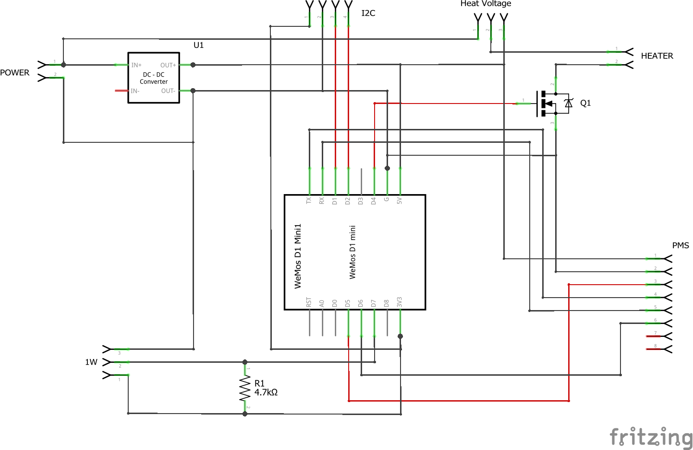

[Homie](https://github.com/marvinroger/homie) based AIR Quality sensor.

## Features:
* PM1.0, PM2.5, PM10 monitoring
* Temperature, himidity and pressure monitoring
* Continous measurement with average calculation for given period
* Data reporting via MQTT
* Fully configurable via MQTT (heater temperature, measure freqnecy)
* Heating of intake air - avoid errors from high air humidity   
* Non blocking (no delay) code with serial support

## Used libraries:
* [Homie](https://github.com/marvinroger/homie/)
* [Homie Node Collection](https://github.com/euphi/HomieNodeCollection)
* [PID](https://github.com/br3ttb/Arduino-PID-Library/)
* [Cactus IO BME280](http://cactus.io/projects/weather/arduino-weather-station-bme280-sensor)

## BOM:
* ESP8266 module (for example Wemos D1 mini)
* Air quality sensor PMS3003
* SI7021 temperature and humidity sensor
* BME280 pressure sensor
* N-MOSFET
* 4k7Ω resistor

## Schematic:


## Installation:

[PlatformIO](http://platformio.org/) and optionally [Atom editor](https://atom.io/) with PlatformIO IDE package are required. See [installation procedure](http://docs.platformio.org/en/stable/ide/atom.html#installation)

### 1. Clone the Repository

``` bash
git clone https://github.com/enc-X/air-monitor
```

or download  [repository](https://github.com/enc-X/air-monitor/archive/master.zip)

### 2. Import project to PlatformIO

Run Atom editor and in **PlatformIO** menu choose option **Open Project folder...**. Select folder with imported project.

### 3. Setup serial Port
From the list with files in the left tab open the platformio.ini and change the **upload_port = com12** to the correct port with your ESP8266.

### 4. Build binary file

In **PlatformIO** menu choose option **Build**

### 5. Upload firmware to ESP8266

Connect ESP to PC via serial adapter. In **PlatformIO** menu choose option **Upload**.

### 6. Installig Homie UI

Copy UI bundle to data/homie folder  (See https://github.com/marvinroger/homie-esp8266/tree/develop/data/homie )

### 7. Upload SPIFFS image to ESP8266

In **Platformio** menu choose option **Run other target ...** and next **PIO uload SPIFFS image**

## Configuration

Software is build on top of Homie framework - configuration will be done in Homie-way. Connect to MyIOT-xxxxx AP and go to configration UI. Also there is Andorid configuration app - see http://marvinroger.github.io/homie-esp8266/develop/configuration/http-json-api/

## Usage


## Credits

Inspiration for this project:
* [SMOG sensor](https://blog.jokielowie.com/en/2017/10/esp-8266-sds011-smog-quick-wifi-sensor/)
* [SMOGLY project](https://github.com/EnviroMonitor)
